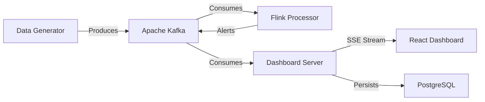

# City Sensor Monitoring System - Technical Documentation

## 1. Project Overview
The **City Sensor Monitoring System** is a distributed system designed to simulate, process, and visualize real-time sensor data from multiple smart cities. It demonstrates a modern event-driven architecture using streaming technologies to handle high-throughput sensor data, detect critical events in real-time, and provide live visualization to operators.

## 2. System Architecture

The system follows a microservices-based, event-driven architecture:


                         +------------------+
                         |  Data Generator  |
                         +--------+---------+
                                  |
                              Produces
                                  |
                         +--------v---------+
                         |   Apache Kafka   |
                        > +---+----------+---+
                       |      |          |
                    Alerts     Consumes     Consumes
                       |      v          |
                +--------------+     -v----------------+
                | Flink Processor |     | Dashboard Server |---------
                +-------+---------+     +---------+--------+        | Persists
                                           |                        |
                                           |                        |
                                           |                                    
                                           |                |  PostgreSQL |
                                           |                 
                                           |             
                                           |
                                           v                                    
                                    SSE Stream            
                                          |               
                                          v               
                                | React Dashboard |




### Core Components:

1.  **Data Generator Service** (`data-generator`)
    *   **Role**: Simulates IoT sensor devices.
    *   **Implementation**: Spring Boot application with scheduled tasks.
    *   **Function**: Generates realistic data for 5 major cities (New York, LA, Chicago, Houston, Phoenix) including smoke levels, vehicle speeds, noise levels, temperature, and air quality.

## Data Examples

Here is how the JSON data looks for each sensor type flowing through the system:

### Smoke/Fire Sensor
```json
{
  "city": "New York",
  "sensor_type": "smoke-fire",
  "timestamp": 1716451200000,
  "location": "Building-123",
  "value": 15.5
}
```

### Vehicle Speed Sensor
```json
{
  "city": "Los Angeles",
  "sensor_type": "vehicle-speed",
  "timestamp": 1716451201000,
  "location": "Road-45",
  "value": 85.0
}
```

### Noise Level Sensor
```json
{
  "city": "Chicago",
  "sensor_type": "noise-level",
  "timestamp": 1716451202000,
  "location": "Nightclub-Downtown",
  "value": 92.5
}
```

### Air Quality Sensor
```json
{
  "city": "Phoenix",
  "sensor_type": "air-quality",
  "timestamp": 1716451203000,
  "location": "City-Center",
  "value": 155.0
}
```

### Temperature Sensor
```json
{
  "city": "Houston",
  "sensor_type": "temperature",
  "timestamp": 1716451204000,
  "location": "City-Center",
  "value": 39.2
}
```

### Generated Alert (Output)
When a threshold is breached (e.g., Temperature > 38°C), the Flink Processor generates an alert:
```json
{
  "alert_type": "temperature",
  "severity": "WARNING",
  "city": "Houston",
  "location": "City-Center",
  "value": 39.2,
  "threshold": 38.0,
  "timestamp": 1716451204500,
  "message": "WARNING: Extreme temperature in Houston! Temp: 39.2°C"
}
```

2.  **Message Broker** (`kafka`)
    *   **Role**: Central nervous system for data transport.
    *   **Implementation**: Apache Kafka.
    *   **Topics**:
        *   `smoke-fire`: Building safety sensors.
        *   `vehicle-speed`: Traffic monitoring.
        *   `noise-level`: Urban noise pollution.
        *   `air-temp`: Environmental conditions.
        *   `alerts`: Critical events detected by Flink.

3.  **Stream Processor** (`flink-processor`)
    *   **Role**: Real-time analytics and event detection.
    *   **Implementation**: Apache Flink (Java API).
    *   **Logic**: Consumes raw sensor streams, applies threshold-based logic (e.g., speed > 100km/h, temp > 38°C), and publishes `CRITICAL` or `WARNING` alerts back to Kafka.

4.  **Dashboard Server** (Part of `data-generator`)
    *   **Role**: Backend for the frontend UI.
    *   **Implementation**: Spring WebFlux (Reactive).
    *   **Features**:
        *   Consumes all Kafka topics.
        *   Streams data to frontend via **Server-Sent Events (SSE)**.
        *   Persists critical alerts and statistics to **PostgreSQL** using **R2DBC** (Reactive Relational Database Connectivity).
        *   Provides REST APIs for historical data and alert acknowledgment.

5.  **Frontend Dashboard** (`city-dashboard`)
    *   **Role**: Visualization and control.
    *   **Implementation**: React, Vite, Leaflet (Maps), Recharts (Charts).
    *   **Features**: Real-time map visualization, live charts, alert management, and city-specific detailed views.

## 3. Technology Stack

*   **Language**: Java 17 (Backend), JavaScript (Frontend)
*   **Frameworks**: Spring Boot (WebFlux, Kafka, R2DBC), React
*   **Streaming**: Apache Kafka, Apache Flink
*   **Database**: PostgreSQL 
*   **Containerization**: Docker, Docker Compose
*   **Build Tools**: Maven, npm

## 4. Data Flow Description

1.  **Generation**: The `SensorGeneratorService` creates random but realistic sensor readings every 1-10 seconds depending on the sensor type.
2.  **Ingestion**: Readings are serialized to JSON and pushed to specific Kafka topics.
3.  **Processing**:
    *   The **Flink Processor** reads these topics in real-time.
    *   It deserializes the JSON and checks values against defined thresholds (e.g., Smoke > 70).
    *   If a threshold is breached, an Alert object is created and pushed to the `alerts` topic.
4.  **Consumption & Storage**:
    *   The **Dashboard Server** listens to both raw sensor topics and the `alerts` topic.
    *   Raw data is immediately broadcast to connected frontend clients via SSE.
    *   Critical alerts are asynchronously saved to PostgreSQL for historical record-keeping.
5.  **Visualization**:
    *   The **React Dashboard** receives the SSE stream.
    *   It updates the in-memory state, causing the map markers to change color (Green/Yellow/Red) and charts to update in real-time.
    *   Users can click on alerts to acknowledge them, triggering an API call to update the database.

## 5. Key Features

*   **Real-time Monitoring**: Sub-second latency from generation to visualization.
*   **Reactive Stack**: Fully non-blocking I/O from DB to UI using Spring WebFlux.
*   **Scalable Processing**: Flink allows for complex event processing on massive data streams.
*   **Interactive UI**: Dynamic map with drill-down capabilities for specific cities.
*   **Historical Analysis**: Persistent storage allows for reviewing past critical events.

## 6. Database Schema

The PostgreSQL database (`citysensor`) contains:

*   **`alerts` table**: Stores critical events.
    *   `id`: Serial primary key
    *   `alert_type`: Type of sensor (e.g., smoke-fire)
    *   `severity`: CRITICAL or WARNING
    *   `city`: City name
    *   `location`: Specific location (e.g., Building-123)
    *   `value`: The sensor reading value
    *   `message`: Human-readable description
    *   `timestamp`: Time of occurrence
    *   `acknowledged`: Boolean status

## 7. Running the Project

The entire system is containerized. To start:

```bash
docker-compose up --build
```

Access points:
*   **Dashboard**: http://localhost:3000
*   **Kafka UI**: http://localhost:8080
*   **Flink Dashboard**: http://localhost:8081


