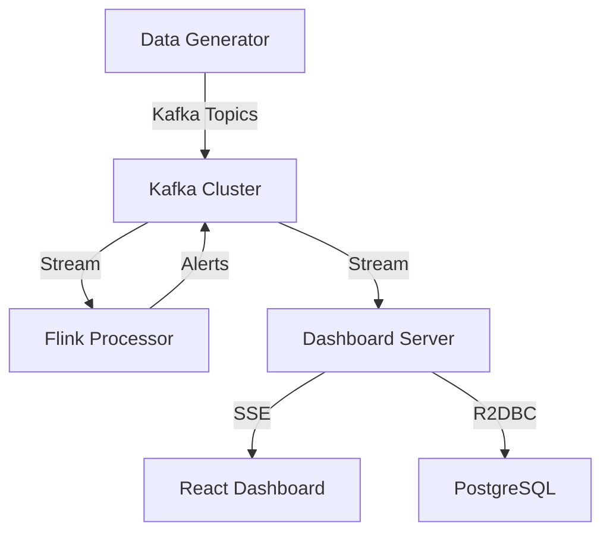

# City Sensor Monitoring System

A real-time distributed system for monitoring urban sensor data across multiple cities using Apache Kafka, Apache Flink, Spring Boot (WebFlux), and React.

## 🏗️ Architecture



### Components

1.  **Data Generator & Dashboard Server** (`data-generator`)
    *   **Generator**: Simulates sensor data (Smoke, Speed, Noise, Temperature) for 5 cities.
    *   **Server**: Spring WebFlux application that consumes Kafka topics and streams data to the frontend via Server-Sent Events (SSE). Also provides REST APIs for historical data.
    *   **Tech**: Spring Boot 3, WebFlux, Spring Kafka, R2DBC (PostgreSQL).

2.  **Apache Kafka**
    *   Message broker for all sensor data and alerts.
    *   Topics: `smoke-fire`, `vehicle-speed`, `noise-level`, `air-temp`, `alerts`.

3.  **Flink Processor** (`flink-processor`)
    *   Real-time stream processing engine.
    *   Detects critical events (e.g., high temperature, speeding) and publishes alerts back to Kafka.

4.  **City Dashboard** (`city-dashboard`)
    *   Modern React frontend for visualization.
    *   Features: Real-time charts, interactive map, alert management.

5.  **PostgreSQL**
    *   Persistent storage for critical alerts and sensor statistics.

## 🚀 Quick Start

### Prerequisites
*   Docker & Docker Compose

### Running with Docker (Recommended)

1.  **Start all services:**
    ```bash
    docker-compose up --build
    ```

2.  **Access the applications:**
    *   **Dashboard UI**: [http://localhost:3000](http://localhost:3000)
    *   **Kafka UI**: [http://localhost:8080](http://localhost:8080)
    *   **Flink Dashboard**: [http://localhost:8081](http://localhost:8081)
    *   **API Health**: [http://localhost:8888/api/health](http://localhost:8888/api/health)

## 🛠️ Local Development

### Prerequisites
*   Java 17+
*   Node.js 20+
*   Maven 3.9+

### 1. Start Infrastructure
Start Kafka, Zookeeper, PostgreSQL, and Flink:
```bash
docker-compose up zookeeper kafka flink-jobmanager flink-taskmanager kafka-ui postgres
```

### 2. Run Data Generator & API
```bash
cd data-generator
mvn spring-boot:run
```
*API will be available at http://localhost:8888*

### 3. Run Flink Processor
```bash
cd flink-processor
mvn clean package
java -jar target/flink-processor-0.0.1-SNAPSHOT.jar
```

### 4. Run React Dashboard
```bash
cd city-dashboard
npm install
npm run dev
```
*Frontend will be available at http://localhost:5173*

## ⚙️ Configuration

### Environment Variables

| Variable | Default | Description |
|----------|---------|-------------|
| `KAFKA_BROKERS` | `localhost:9092` | Kafka bootstrap servers |
| `DB_HOST` | `localhost` | PostgreSQL host |
| `DB_PORT` | `5432` | PostgreSQL port |
| `DB_NAME` | `citysensor` | Database name |
| `DB_USER` | `postgres` | Database user |
| `DB_PASSWORD` | `postgres` | Database password |

### Alert Thresholds

| Sensor Type | Warning | Critical |
|-------------|---------|----------|
| Smoke/Fire | - | 70+ |
| Vehicle Speed | 100+ km/h | 130+ km/h |
| Noise Level | 90+ dB | 100+ dB |
| Air Quality (AQI) | 150+ | 200+ |
| Temperature | < 0°C or > 38°C | - |

## 📝 API Endpoints

*   **GET** `/api/stream` - SSE stream for real-time sensor data
*   **GET** `/api/health` - Health check
*   **GET** `/api/alerts/recent` - Recent alerts (params: `hours`, `limit`)
*   **GET** `/api/alerts/critical` - Unacknowledged critical alerts
*   **GET** `/api/statistics/{city}` - City statistics

## 🔧 Troubleshooting

*   **Kafka Connection**: Ensure `KAFKA_BROKERS` is correct. Check Kafka UI at port 8080.
*   **Database**: Ensure PostgreSQL is running and the schema is initialized.
*   **No Data**: Check if `data-generator` is running and producing messages to Kafka.
